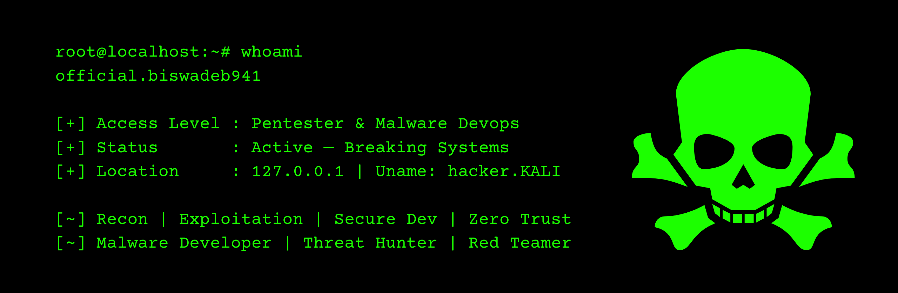

<h1 align="center">
  <br>
  <b>🜂 Mr. Biswadeb Mukherjee</b>  
  <br>
  <font size="4">
    Offensive Security Specialist • Malware Engineer
  </font>
  <br>
  
  <a href="https://github.com/official-biswadeb941?tab=followers">
    
  </a>
  <a href="https://official-biswadeb941.in">
    
  </a>
</h1>


# 🜁 My Identity

I work in offensive security with the discipline of someone who studies shadows, dissolution and hidden architecture.
My craft follows a deeper reading of systems: truth appears only when illusion is stripped away.

Kali Linux isn’t just a platform to me.
It reflects a principle I follow in every layer of my work: **clarity through breaking, evolution through pressure, revelation through disassembly**.

My methods draw from:

- adversarial engineering
- low-level behavioral study
- symbolic and structural mapping
- hidden-layer exploration

I move through systems the way a seeker walks the cremation ground —
with precision, presence and a willingness to examine what others avoid.

---

# 🜄 About Me

I study systems as layered entities — patterns on the surface, structures beneath, shadows at the core.

My work centers on:

- offensive security engineering
- adversary simulation
- malware behavior modeling
- covert communication design
- low-noise operational tooling
- metaphysical pattern interpretation
- software engineering
- API orchestration
- codebase analysis and vulnerability assessment

I read infrastructures as living texts:
every fault a message, every anomaly a marker, every structure a doctrine of concealed logic.

---

# 🜃 Expertise Overview

<table border="1" cellpadding="6" cellspacing="0">
  <tr>
    <td>
      <h3>🔥 Red Team & Shadow Operations</h3>
      <p>Adversary pathway design<br>
      Covert movement strategy<br>
      Infrastructure concealment<br>
      Behavioral evasion research</p>
    </td>
    <td>
      <h3>🜂 Malware R&D</h3>
      <p>Custom executable logic<br>
      Runtime behavior mapping<br>
      Payload architecture<br>
      Evade–observe–reconstruct modeling</p>
    </td>
  </tr>

  <tr>
    <td>
      <h3>🌐 Protocol & Flow Reading</h3>
      <p>DNS & HTTP/2 signature study<br>
      Low-profile channel design<br>
      Structural traffic shaping</p>
    </td>
    <td>
      <h3>🛠 Engineering Discipline</h3>
      <p>Golang tooling<br>
      Python automation<br>
      Linux internals<br>
      Secure pipeline design</p>
    </td>
  </tr>

  <tr>
    <td>
      <h3>💻 Systems Architecture</h3>
      <p>Distributed logic<br>
      API ecosystems<br>
      Root-level structural thinking<br>
      Resilient system design</p>
    </td>
    <td>
      <h3>🧭 Applied Analysis</h3>
      <p>Operational heuristics<br>
      Failure-surface mapping<br>
      Environment-driven modeling<br>
      Low-noise design principles</p>
    </td>
  </tr>
</table>


---

# 🜃 Research Fields

<table border="1" cellpadding="6" cellspacing="0">
  <tr>
    <th>Area</th>
    <th>Focus</th>
  </tr>

  <tr>
    <td>Command & Control Philosophy<br>
    <i>(quiet channels and adaptive presence)</i></td>
    <td>
      <ul>
        <li>Quiet communication flows</li>
        <li>Low-profile traffic behavior</li>
        <li>Alternative protocol pathways</li>
      </ul>
    </td>
  </tr>

  <tr>
    <td>Metaphysics of Evasion<br>
    <i>(how defenses shape and distort behavior)</i></td>
    <td>
      <ul>
        <li>Research on evading modern security controls</li>
        <li>Syscall-pattern behavior</li>
        <li>Memory-boundary interpretation</li>
      </ul>
    </td>
  </tr>

  <tr>
    <td>Payload Survival Doctrine<br>
    <i>(what persists when environments collapse)</i></td>
    <td>
      <ul>
        <li>Staged deployment logic</li>
        <li>High-entropy transformations</li>
        <li>Resilience-focused architecture</li>
      </ul>
    </td>
  </tr>
</table>

---

# 🛠️ Tools & Platforms

<p align="center">
  
  
  
  
  
</p>

---

# 🜁 Languages & Systems

<p align="center">
  
  
  
  
  
</p>

---

# 🜃 Project History

<table border="1" cellspacing="0" cellpadding="6">
  <tr>
    <th>Project</th>
    <th>Essence</th>
    <th>Stack</th>
    <th>Link</th>
    <th>Status</th>
    <th>Year</th>
  </tr>

  <tr>
    <td><b>IDify</b></td>
    <td>Decentralized identity, credentials & reputation protocol</td>
    <td>React, Aptos SDK, dApp, Solidity</td>
    <td><a href="https://github.com/official-biswadeb941/IDify">Visit Now</a></td>
    <td>Archived</td>
    <td>2025</td>
  </tr>

  <tr>
    <td><b>HopZero-DNS</b></td>
    <td>High-performance DNS resolution flow</td>
    <td>Golang</td>
    <td><a href="https://github.com/official-biswadeb941/HopZero-DNS">Visit Now</a></td>
    <td>Active</td>
    <td>2025</td>
  </tr>

  <tr>
    <td><b>Incognito-Vault</b></td>
    <td>Security demo: web app analysis & cryptography</td>
    <td>Python Flask</td>
    <td><a href="https://github.com/official-biswadeb941/IncognitoVault">Visit Now</a></td>
    <td>Archived</td>
    <td>2024–2025</td>
  </tr>

  <tr>
    <td><b>ClopiMedi</b></td>
    <td>Secure machine learning health analysis</td>
    <td>Python, ML (synthetic data)</td>
    <td><a href="https://github.com/official-biswadeb941/ClopiMedi---Your-Heart-s-Trusted-Care">Visit Now</a></td>
    <td>Archived</td>
    <td>2024</td>
  </tr>

  <tr>
    <td><b>Mayabati</b></td>
    <td>First ML project: Bi-LSTM recipe recommendation</td>
    <td>Bi-LSTM, Python</td>
    <td><a href="https://github.com/official-biswadeb941/Mayabati---Your-Personal-AI-Chef">Visit Now</a></td>
    <td>Paused</td>
    <td>2025</td>
  </tr>
</table>

---

# 🏆 Awards & Achievements

- Achieved **3rd Place** at the **1st International Conference on Smart Technology for Emerging Problems (STEP 2025)**  
  *(Recognition earned for the project **Mayabati**, a Bi-LSTM powered recipe recommendation system)*  

- Ranked in the **Top 5** at the IEEE–IC Standard Hackathon & APSIMSS  
  *(IIT Guwahati, 16–18 December 2024)*  


---

# 🛡️ Digital Identity Verification

All official communication is cryptographically signed.

- **Owner:** Mr. Biswadeb Mukherjee  
- **Email:** admin@official-biswadeb941.in  
- **OpenPGP Fingerprint:** `2D31 1898 5F46 8437 F8E6 0B9E A2F0 3FF3 10A0 EE1F`
- **Signed Message:** http://official-biswadeb941.in/official-biswadeb941_v2.txt.asc 
- **Public Key:** https://keys.openpgp.org/vks/v1/by-fingerprint/2D3118985F468437F8E60B9EA2F03FF310A0EE1F  

**Follow the steps below to verify the signature:**

### Step 1. Download the signed message

```bash
curl -L -o official-biswadeb941_v2.txt.asc \
http://official-biswadeb941.in/official-biswadeb941_v2.txt.asc
```

### Step 2. Download the public key

```bash
curl -L -o official-biswadeb941_public-key.asc \
"https://keys.openpgp.org/vks/v1/by-fingerprint/2D3118985F468437F8E60B9EA2F03FF310A0EE1F"
```

### Step 3. Import the public key

```bash
gpg --import official-biswadeb941_public-key.asc
```

### Step 4. Verify the fingerprint:

```bash
gpg --fingerprint 2D3118985F468437F8E60B9EA2F03FF310A0EE1F
```

### Step 5. Verify the signature: 
```bash
gpg --verify official-biswadeb941_v2.txt.asc
```

A valid signature will display a “Good signature” message along with the matching fingerprint.

---

# 🤝 Collaboration

Open to alliances involving:

- Offensive Security 
- Red Team Operations
- Malware Engineering
- Secure Hosting  
- Software Engineering
- Full stack development 
- Code Review & Audit
- Consultancy
---

# ⚖️ Legal, Ethics & Identity Scope

All work, research, tooling, writings, and publications associated with this identity are governed by clearly defined legal and ethical boundaries.

This applies consistently across all platforms where this identity is represented, including but not limited to:

- GitHub repositories and organizations  
- Official website and subdomains  
- Technical blogs and research write-ups  
- Documentation, whitepapers, and published tools  
- Talks, demonstrations, and shared proofs of concept  

For updated **Legal Policy & Terms of Use** Visit my website: https://official-biswadeb941.in/legal-policy

Any interaction, reuse, collaboration, or reference to material associated with this identity implies acknowledgment of these terms and applicable law.

---


# 📡 Contact

- **Email:** admin@official-biswadeb941.in  
- **LinkedIn:** https://linkedin.com/in/biswadeb-mukherjee  
- **Website:** https://official-biswadeb941.in  

---

# 📊 GitHub Analytics

<p align="center">
  
</p>

<p align="center">
  
  
</p>

<p align="center">
  
</p>

<p align="center">
  
</p>

---
